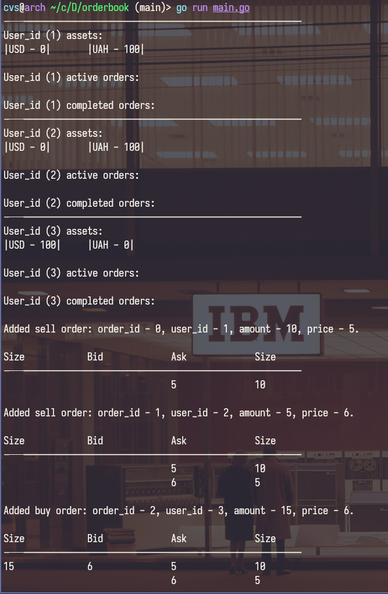
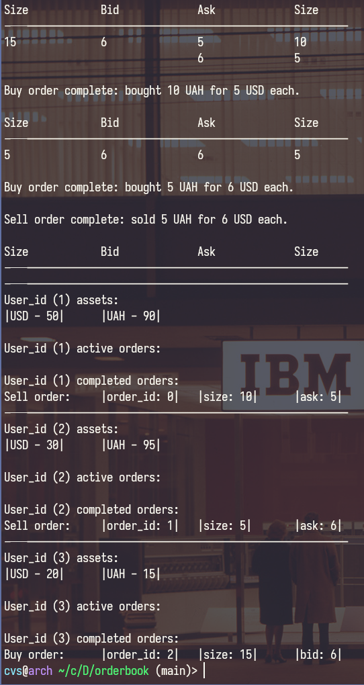

# Implementation of order book for two assets: UAH and USD
## Features:
- Placing Buy/Sell orders, automatic sorting of order and automatic order matching
- Checking a new user's order for sufficient assets before adding it to the order book
- Printing all active orders after adding or completing an order
- User information output: balance, active and completed orders
##### Used Go standart library
### Program execution example:
```sh
go run main.go
```
### Output:


